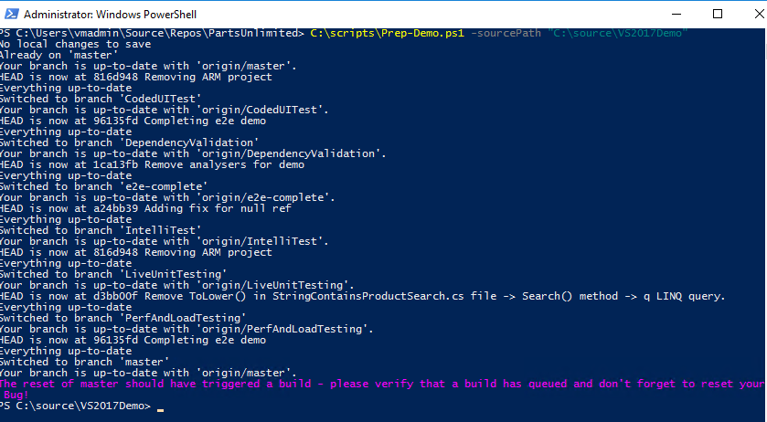

# Visual Studio 2017 Sales Enablement - Virtual Machine Setup

This is the repository for Visual Studio 2017 Sales and Partner Enablement Resource for sellers and technical professionals. You will find sales and technical resources that will enable you to sell Visual Studio Enterprise 2017.

There are two components for the demos:
- Windows VM workstation (Windows Server 2016 Datacenter) that contains Visual Studio 2017 (15.2), Chrome, Firefox, Git, and other dependencies
- Visual Studio Team Services project and Azure components for the deployment of the PartsUnlimited app

This walkthrough will help you set up the workstation (Azure Virtual Machine) that will use an Azure Resource Management (ARM) template and install/configure dependencies.

**Tasks**

1. Create the Virtual Machine
2. Install the Snapshot Debugger Extension for Visual Studio
3. Create the Visual Studio Team Services project
4. Clone the PartsUnlimited repository from VSTS
5. Add branches to the local PartsUnlimited repository using the Connect-Git.ps1 script
6. Preparing for a demo using the Prep-Demo.ps1 script

## Task 1: Create the Virtual Machine
    
1. Create the Virtual Machine
    
    Simply click the Deploy to Azure button below and follow the wizard to create a VM. You will need to log in to the Azure Portal.

	
	

2. Specify settings for the deployment

	Specify settings in the ARM template:
	- Azure subscription
	- Resource group
	- Location
	- VM DNS name for Public IP
	- Virtual Machine size
	- Visual Studio Workloads ([workloads and component IDs](https://docs.microsoft.com/en-us/visualstudio/install/workload-component-id-vs-enterprise))
	- Admin username
	- Admin password
                                                                     
3. Deploy the ARM template and configure dependencies

	After filling in the appropriate settings, click on the checkbox to agree to terms and conditions, then click on the "Purchase" button to deploy the ARM template. 

	The deployment process may take around 30 minutes to complete. Once the deployment finishes, you may connect to the machine in an RDP session from the Azure Portal. 

## Task 2: Install the Snapshot Debugger Extension for Visual Studio

1. Download the Snapshot Debugger extension from the Visual Studio Marketplace

	Log into the demo VM through an RDP session and open up a browser through the RDP session on the demo VM. Then, navigate
 	to the [Visual Studio Marketplace](https://marketplace.visualstudio.com/items?itemName=SnapshotDebuggerTeam.MicrosoftSnapshotDebugger) and click the "Download" button to download the Snapshot Debugger extension onto the demo VM.

	 **Note:**By going to the Visual Studio Marketplace, this will download the latest version of the extension.

2. Install the Snapshot Debugger extension

	Once the extension (.vsix) file has been downloaded, double-click on the file and click the "Install" button to install it. 

3. And that's it! The Snapshot Debugger extension should be installed for use in Visual Studio Enterprise. 

## Task 3: Create the Visual Studio Team Services project

1. Create the VSTS project

For VSTS, you can either

- Use the devopsconferences account but you will have only read-only access to the project.
- Choose to provision the project to your own VSTS account with [VSTS Demo Data Generator](http://vstsdemogenerator.azurewebsites.net/Account/Verify?template=PartsUnlimited).

2. Keep track of the name of the VSTS account as well as the project.

## Task 4: Clone the PartsUnlimited repository from VSTS

1. Connect to a project

Log back into the demo VM and open up Visual Studio 2017. Connect to a VSTS project by clicking on the plug icon in the Team Explorer panel, clicking on the "Manage Connections" hyperlink, then clicking on the "Connect to Project" button that pops up. 

2. Log into the VSTS account 

The "Connect to a Project" panel should appear, so click ont the dropdown next to "Add an account..." and click on the "Add an account..." button to add a new VSTS account. You may have to add the corresponding browser pages to trusted sites when you are prompted to log in (or turn off enhanced security configuration in Internet Explorer). Log into the appropriate VSTS account using your Microsoft account or organizational account. 

3. Clone the repository

Once you are logged in using your Microsoft or organizational account, select the VSTS account, then the project, then expand the arrow to the left of the project name and select the "PartsUnlimited" repository. Specify the path that you want to clone the repository onto the demo VM such as `C:\source\VS2017Demo` (default is `C:\Users\vmadmin\Source\Repos\PartsUnlimited`) then press the "Clone" button. Keep track of the source path that you have chosen as you will need it in Task 5. 

4. After you have cloned the repository, Team Explorer should show a successful banner that the repository was cloned successfully. 

## Task 5: Add branches to the local PartsUnlimited repository using the Connect-Git.ps1 script

1. Run the following command in a PowerShell console:

`C:\scripts\Connect-Git.ps1 -sourcePath {sourcePath}`

| Variable | Value |
|---|---|
| _{sourcePath}_ | Source Path to existing PartsUnlimited repo (such as `C:\source\VS2017Demo`) |	

The corresponding branches relating to Feature Demos should now be available on the demo VM locally to switch to when walking through a demo. 

## Task 6: Preparing for a demo using the Prep-Demo.ps1 script

1. Reset the code

To reset the code and website to the beginning of the demo, you need to undo and changes to code (including any you pushed) and run a build/release of the "broken" code.

To do this, run the following command in a PowerShell console:

`C:\scripts\Prep-Demo.ps1 -sourcePath {sourcePath}`

| Variable | Value |
|---|---|
| _{sourcePath}_ | Source Path to existing PartsUnlimited repo (such as `C:\source\VS2017Demo`) |	

You should also delete the bug you used in your demo and create a new bug with the same description as the bug from the demo (Bug 1065). Place the new Bug into the Develop column, Expedite swimlane on the Backlog board.